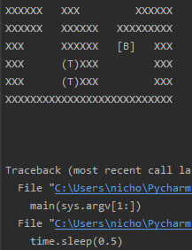

# COMP3702 assignment 1

Background
Sokoban is a puzzle video game introduced in Japan in 1981. The word Sokoban
means “warehouse keeper” in Japanese which refers to the main character of the
game. In this game, the player controls the warehouse keeper who is in a closed
warehouse with a number of boxes that need to be put on some predefined target
locations. The keeper can move around the warehouse and the goal of the game is
to push all boxes onto the target positions in the fewest number of moves. An
example state of the game is shown in Figure 1.

How to play
The warehouse is a grid where each square is a floor or wall tile. In each step, the
keeper can move in any of the four basic directions (up, down, left, right). The
keeper cannot walk into a wall or into a box. The keeper can however push a box
if the square next to the box (in the pushing direction) is either a target or an
empty square. Only one box can be pushed in any given step. If there are multiple
targets, each box can go in any of the target positions and can be placed on targets
in any order. A box can also be pushed off a target if needed. The game ends as
soon as every box is in a target position.

Search Algorithms
This project explores different search algorithms to find the optimal solution to solving the game Sokoban

Everything needed to run the project is in the solver folder, or the a1-COMP3702-44373388-45948457 zip used for submission. The text files found in the testcases folder are examples of sokoban maps and can be used as input files to the solver.

Example solution to a difficult map:

